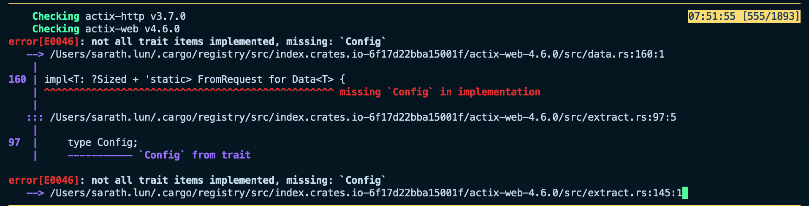
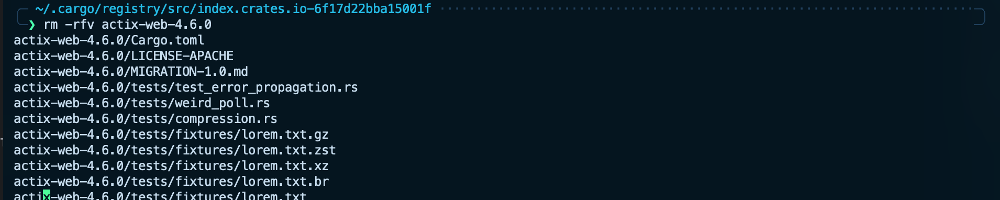
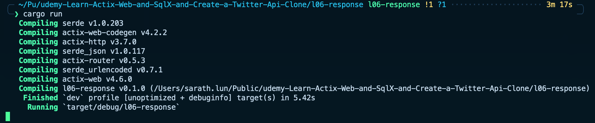
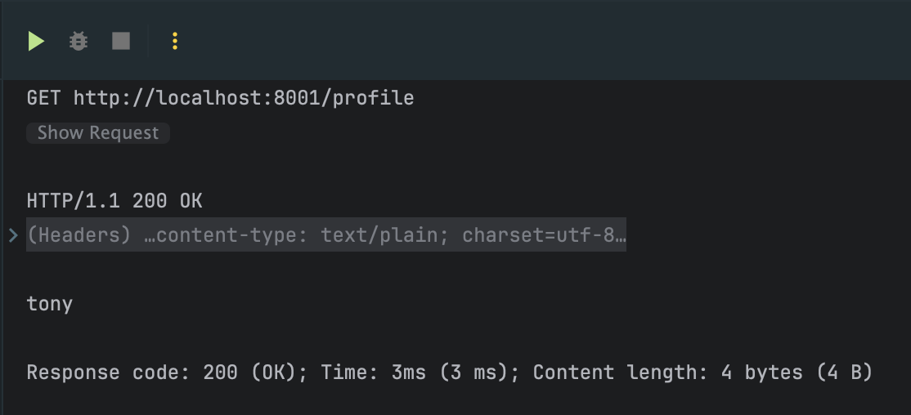

# Lesson 06: Response

1. **Responders and Extractors**: responders are the inverse of extractors. While extractors take client input and pass it to handlers in a type-safe way, responders take static Rust types and serialize them into output types (e.g., JSON) to return to the client.
2. **Pre-implemented Responders**: Rust's web framework comes with pre-implemented responders for common types like `String`, `&str`, and `HttpResponse`. this can be used directly without additional implementation.
3. **HttpResponse**: the `HttpResponse` type can be used to manually generate entire HTTP responses, including custom headers and content types.
4. **Json Extractor as Responder**: the `Json` type, used previously as an extractor for inputs, can also be used to wrap output types and act as a responder. this simplifies the return process for types that need to be serialized to JSON.
5. **Custom Responders**: custom types can implement the `Responder` trait to define how they should be serialized and returned to the client. this is useful for maintaining clear and specific type signatures in handler functions.

### Labs:

- I code the file `src/main.rs` as lecture as below:
```rust
use actix_web::{App, HttpServer, web};

use crate::string_str::get_profile_name;

mod string_str;

#[actix_web::main]
async fn main() -> std::io::Result<()> {
    HttpServer::new(move || {
        App::new()
            .service(
                web::resource("/profile")
                    .route(web::get().to(get_profile_name))
            )

    })
        .bind(("127.0.0.1", 8001))?
        .run()
        .await
}
```

- I code file `src/string_str.rs` as lecture as below:
```rust
pub async fn get_profile_name() -> &'static str {
    "tony"
}
```

- when try to start the server, got below error:

- this error took me 2 days to figure out that somehow it mess up with my cargo indexing, so try to remove `actix-web` from my cargo index:

- then run the server, unfortunately it's works!

- and I have http-client file to test as below:
```http request
### GET /profile
GET http://localhost:8001//profile
```
- which is equal to cURL as below:
```shell
curl -X GET --location "http://localhost:8001/profile"
```
- I got successful output as below:


- then I implement another 3 more approach:
  - [json_response](./src/json_response.rs)
  - [http_response](./src/http_response.rs)
  - [impl_response](./src/impl_response.rs)
